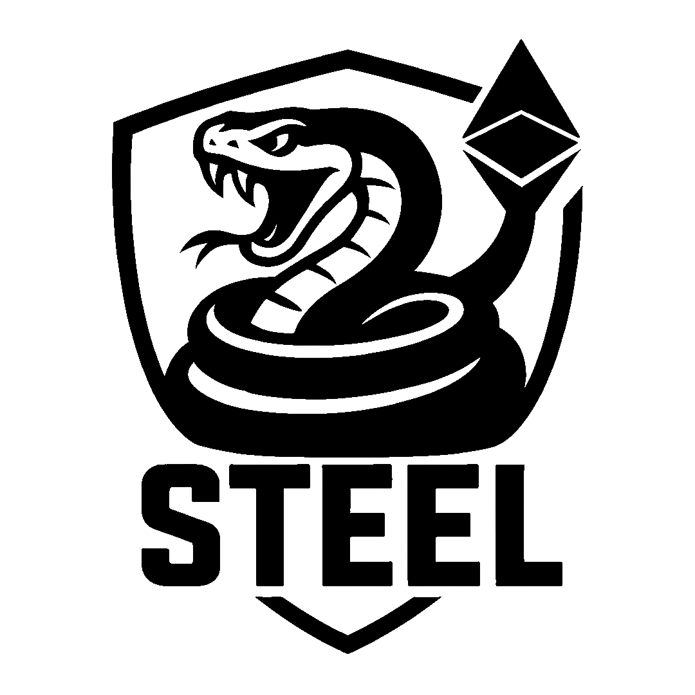
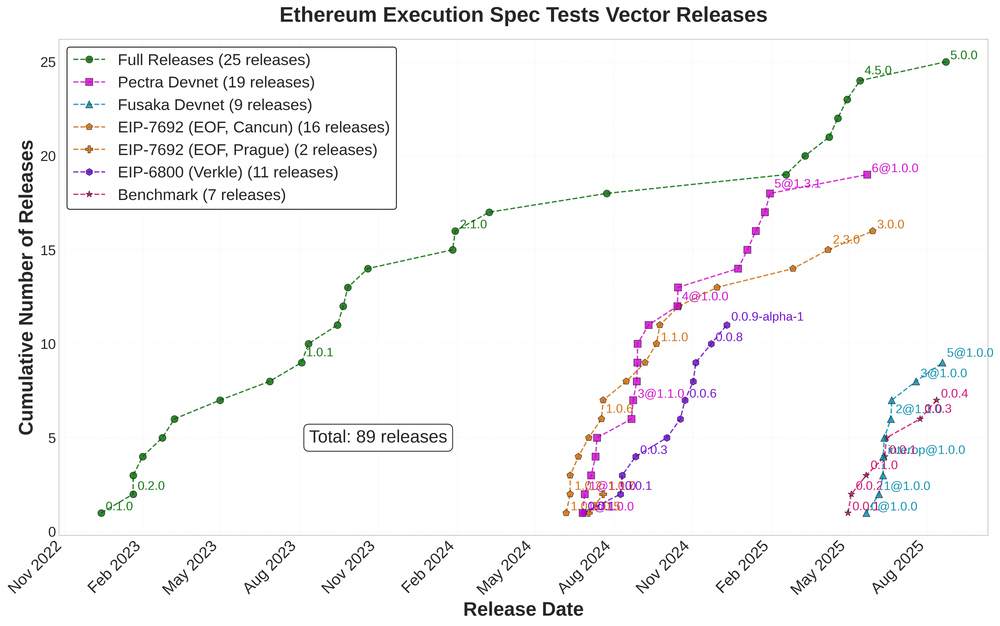

### STEEL

##### 🐍Specifications and Testing for the Ethereum Execution Layer 📐🧪🐍

    <a style="font-size: 0.70em" href="https://github.com/danceratopz/">danceratopz</a> 
    EF Town Hall, 2025-08-18

---

### STEEL Acronyms

|       |                                                      |      |
| ----- | ---------------------------------------------------- | ---- |
| STEEL | Specs & Testing for the  Ethereum Execution Layer | ⚔️🛡️ |
| EELS  | Execution Layer Specs                                | 📐   |
| EEST  | Execution Spec Tests                                 | 🧪   |

---

### EELS and EEST Origins & Growth

---

### STEEL TEAM Goals

1. EIP specifications are clear, sufficient and correct.
2. EL clients are adequately tested before hard forks.

**Achieving these goals is a collaborative effort!**

|                      |                           |
| -------------------- | ------------------------- |
| Researchers          | Spec Definition           |
| Client Developers    | Production Implementation |
| Security Researchers | Production Testing        |

---

### Core Responsibilities: EELS📐

- Maintaining EL specs as executable Python Code.
  - Enabling EIP prototyping.
- Publishing releases of spec snapshots.
- Providing the reference EVM for tests.

---

### Core Responsibilities: EEST🧪

- Python test cases for EIPs / Scale the L1.
- Test vector generation framework.
- Continuous delivery of reference test case releases to clients.
- Module & system test frameworks (Hive simulators) and help debugging fails.

---

### Core Responsibilities: EEST🧪

---

### Current Mainnet Testing

**Fusaka**: Primary testing focus (in-team)

**Glamsterdam**: BALS specs & tests (Toni/Rahul)

**Scale the L1**: Pathological test generation (benchmarking, zkevm)

- Collaboration with Nethermind & EF teams
- New Blockchain Test "EngineX" format

---

### Challenges and Strategy

|                                                   |                                                   |
| ------------------------------------------------- | ------------------------------------------------- |
| Technical debt: ethereum/tests; separate repos    | Fill ethereum/tests in EEST; Merge EELS and EEST: The Weld🔥⚔️ |
| Estimating & Tracking Spec                        | Introduce more process; Scale the STEEL           |
| Complete Coverage is Hard                         | Hardening Sessions EIP Checklist, Post Mortems    |
| Broad responsibility scope: CL, benchmarking, RPC | Scale the STEEL, Improved team org            |

---

### Links

Soon: steel.ethereum.foundation

Docs:

- EELS docs, e.g. [MODEXP changes in Osaka](https://ethereum.github.io/execution-specs/diffs/prague/osaka/vm/precompiled_contracts/modexp.py.html)
- [EEST test case documentation](https://ethereum.github.io/execution-spec-tests/main/tests)

Repos and releases:

- [ethereum/execution-specs](https://github.com/ethereum/execution-specs)
- [ethereum/execution-spec-tests](https://github.com/ethereum/execution-spec-tests)
- [EELS releases on PyPI](https://pypi.org/project/ethereum-execution/)
- [EEST releases on Github](https://github.com/ethereum/execution-spec-tests/releases)

---

Thanks!

---
