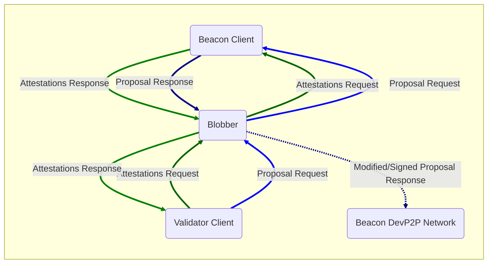

### EEST x Security Team: EEST Tooling Overview

    2025-08-20

---

### `consume direct`

| Interface | Components | Best For |
|-----------|------------|----------|
| State Test (`statetest`) | EVM | Rapid EVM development and debugging |
| Block Test (`blocktest`) | EVM, block processing | Fast block validation testing |

**Common**: Environment: None | Scope: Module test, Integration test

---

### `consume rlp`

|  |  |
|--|--|
| Description | Client imports RLP-encoded blocks upon start-up in Hive |
| Components | EVM, block processing, RLP import (sync) |
| Environment | Staging, Hive |
| Scope | System test |
| Best for | Historical sync simulation |

---

### `consume engine`

|  |  |
|--|--|
| Description | Client imports blocks via Engine API `EngineNewPayload` in Hive |
| Components | EVM, block processing, Engine API |
| Environment | Staging, Hive |
| Scope | System test |
| Best for | Post-merge production-like testing |

Soon: `consume enginex` > 10x faster.

---

### `consume sync`

|  |  |
|--|--|
| Description | Client syncs from another client using Engine API in Hive |
| Components | EVM, block processing, Engine API, P2P sync |
| Environment | Staging, Hive |
| Scope | System test |
| Best for | Testing client synchronization capabilities |

---

### `execute remote`

|  |  |
|--|--|
| Description | Tests executed against a client via JSON RPC `eth_sendRawTransaction` on a live network |
| Components | EVM, JSON RPC, mempool, EL-EL/EL-CL interaction (indirectly) |
| Environment | Production |
| Scope | System Test |
| Best for | Real network testing and validation |

---

### `execute hive`

|  |  |
|--|--|
| Description | Tests executed against a client via JSON RPC `eth_sendRawTransaction` in Hive |
| Components | EVM, JSON RPC, mempool |
| Environment | Staging, Hive |
| Scope | System test |
| Best for | Mempool and transaction execution testing |

---

### `execute eth-config`

|  |  |
|--|--|
| Description | Test that the response from the `eth_config` endpoint matches expectations |
| Components | JSON RPC, client config |
| Environment | Production |
| Scope | System Test |

---

### Blobber

<https://github.com/marioevz/blobber>

---

### eest-fuzz

New repo, relatively unused(?):

- <https://github.com/SamWilsn/eest-fuzz>

---

### Relevant: The Weld ⚔️🔥

- Now, we have two repos:
    - ethereum/execution-specs
    - ethereum/execution-spec-tests

- Q4 2025:
    - EEST will move to ethereum/execution-specs

Aim:
- Huge dev-ex gain for EIP Authors & Testers.
- Will make EEST test coverage of EELS trivial.

---

### Questions

- Do you see any gaps in our work / quick wins?
- How can EEST help facilitate fuzzing?
  - Are the formats adequate?
  - No recent progress in `consume direct`, blocker?
  - Can we help with tooling to fuzz devnets?
- Join EIP hardening sessions?

---

thanks!

---

### EELS and EEST Origins & Growth

---

### STEEL TEAM Goals

1. EIP specifications are clear, sufficient and correct.
2. EL clients are adequately tested before hard forks.

**Achieving these goals is a collaborative effort!**

|                      |                           |
| -------------------- | ------------------------- |
| Researchers          | Spec Definition           |
| Client Developers    | Production Implementation |
| Security Researchers | Production Testing        |

---

### Core Responsibilities: EELS📐

- Maintaining EL specs as executable Python Code.
  - Enabling EIP prototyping.
- Publishing releases of spec snapshots.
- Providing the reference EVM for tests.

---

### Core Responsibilities: EEST🧪

- Python test cases for EIPs / Scale the L1.
- Test vector generation framework.
- Continuous delivery of reference test case releases to clients.
- Module & system test frameworks (Hive simulators) and help debugging fails.

---

### Core Responsibilities: EEST🧪

---

### Links

Soon: steel.ethereum.foundation

Docs:

- EELS docs, e.g. [MODEXP changes in Osaka](https://ethereum.github.io/execution-specs/diffs/prague/osaka/vm/precompiled_contracts/modexp.py.html)
- [EEST test case documentation](https://ethereum.github.io/execution-spec-tests/main/tests)

Repos and releases:

- [ethereum/execution-specs](https://github.com/ethereum/execution-specs)
- [ethereum/execution-spec-tests](https://github.com/ethereum/execution-spec-tests)
- [EELS releases on PyPI](https://pypi.org/project/ethereum-execution/)
- [EEST releases on Github](https://github.com/ethereum/execution-spec-tests/releases)

---

Thanks!

---
